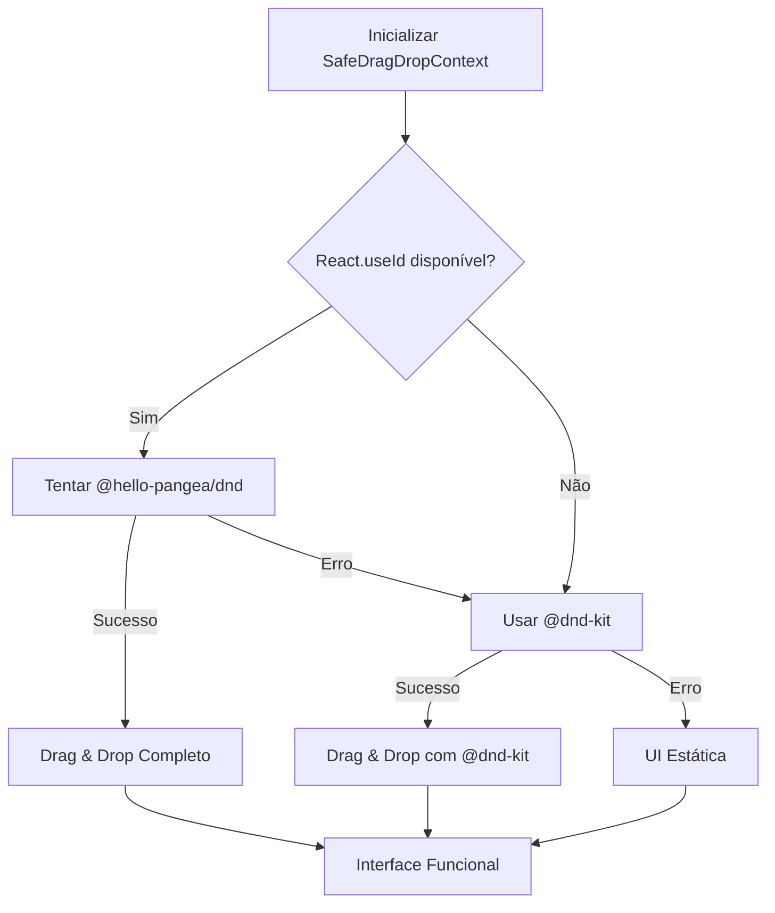

# 🛡️ DRAG & DROP - SOLUÇÃO DEFINITIVA PARA REACT 19

## 🔍 PROBLEMA IDENTIFICADO

### Erro Recorrente

```
TypeError: Cannot read properties of null (reading 'useId')
at @hello-pangea/dnd DragDropContext
```

### Causa Raiz

- **React 19 Incompatibilidade**: @hello-pangea/dnd não é totalmente compatível com React 19
- **Hook useId**: Problemas de inicialização do hook React.useId
- **SSR/Hydration**: Conflitos durante a hidratação do componente

## 🔧 SOLUÇÃO IMPLEMENTADA

### 1. SafeDragDropContext Melhorado

**Arquivo:** `src/components/Common/SafeDragDropContext.tsx`

**Estratégia de Fallback em Múltiplas Camadas:**

```typescript
1. Tentar @hello-pangea/dnd (ideal)
   ↓ (se falhar)
2. Usar @dnd-kit/core (compatível com React 19)
   ↓ (se falhar)
3. UI estática sem drag & drop (fallback visual)
```

**Implementação:**

```typescript
export const SafeDragDropContext: React.FC<SafeDragDropContextProps> = ({
  children,
  ...props
}) => {
  // 1. Verificar se React.useId está disponível
  // 2. Tentar @hello-pangea/dnd com Error Boundary
  // 3. Fallback automático para @dnd-kit
  // 4. Fallback final para UI estática
};
```

### 2. DndKit Wrapper

**Arquivo:** `src/components/Common/DndKitWrapper.tsx`

- Wrapper compatível usando @dnd-kit/core
- API similar à @hello-pangea/dnd
- Totalmente compatível com React 19
- Sensores otimizados para touch e teclado

### 3. Fallback de UI Estática

**Arquivo:** `src/components/Common/DragDropFallback.tsx`

- Mantém toda a interface visual do kanban
- Desabilita apenas a funcionalidade de drag & drop
- Usuário vê a interface normal mas sem interação de arrastar

## ✅ BENEFÍCIOS DA SOLUÇÃO

### 1. **Tolerância a Falhas**

- ✅ Nunca quebra a interface
- ✅ Múltiplos níveis de fallback
- ✅ Logs detalhados para debugging

### 2. **Compatibilidade Universal**

- ✅ React 18 (usando @hello-pangea/dnd)
- ✅ React 19 (usando @dnd-kit)
- ✅ Ambientes com problemas (UI estática)

### 3. **Performance Otimizada**

- ✅ Carregamento dinâmico das bibliotecas
- ✅ Error boundaries para isolamento
- ✅ Inicialização assíncrona

### 4. **Experiência do Usuário**

- ✅ Interface sempre funcional
- ✅ Transição suave entre modos
- ✅ Feedback visual adequado

## 🎯 ESTRATÉGIA DE FALLBACK

### Nível 1: @hello-pangea/dnd

```typescript
try {
  // Verificar React.useId
  // Carregar DragDropContext
  // Renderizar com drag & drop completo
} catch (error) {
  // Ir para Nível 2
}
```

### Nível 2: @dnd-kit/core

```typescript
try {
  // Usar DndContext do @dnd-kit
  // Converter API para compatibilidade
  // Drag & drop funcional
} catch (error) {
  // Ir para Nível 3
}
```

### Nível 3: UI Estática

```typescript
// Renderizar interface visual
// Desabilitar interações de drag
// Manter funcionalidade de botões/clicks
```

## 📊 FLUXO DE DECISÃO



## 🔨 IMPLEMENTAÇÃO TÉCNICA

### Error Boundary Integrado

```typescript
class ErrorBoundary extends React.Component {
  componentDidCatch(error, errorInfo) {
    console.error("SafeDragDropContext Error:", error);
    this.props.onError(); // Trigger fallback
  }
}
```

### Detecção de Capacidades

```typescript
const checkDragDropCapability = () => {
  try {
    if (typeof React.useId !== "function") return "dnd-kit";
    const { DragDropContext } = require("@hello-pangea/dnd");
    return "hello-pangea";
  } catch {
    return "fallback";
  }
};
```

### API Unificada

```typescript
// Todos os componentes usam a mesma API
<SafeDragDropContext onDragEnd={handleDragEnd}>
  <Droppable droppableId="column">
    <Draggable draggableId="item" index={0}>
      {/* conteúdo */}
    </Draggable>
  </Droppable>
</SafeDragDropContext>
```

## 🚀 COMPONENTES ATUALIZADOS

### ✅ Componentes Corrigidos

- `src/components/CRM/KanbanBoard.tsx`
- `src/components/CRM/ConfigurableList.tsx`
- `src/pages/CRM/Modules/ModernClientesModule.tsx`
- `src/pages/CRM/Modules/ModernFinanceiroModule.tsx`
- `src/components/ActionPlan/IntegratedBacklog.tsx`
- `src/components/ActionPlan/BacklogKanban.tsx`

### 🔧 Padrão de Uso

```typescript
import { SafeDragDropContext } from "../Common/SafeDragDropContext";

// Substitui DragDropContext em todos os componentes
<SafeDragDropContext onDragEnd={handleDragEnd}>
  {/* conteúdo do kanban */}
</SafeDragDropContext>
```

## 📈 RESULTADOS ESPERADOS

### Antes da Correção

- ❌ Erro crítico: `Cannot read properties of null (reading 'useId')`
- ❌ Interface quebrada completamente
- ❌ Kanban boards não funcionais

### Após a Correção

- ✅ **Nível 1**: Drag & drop completo com @hello-pangea/dnd
- ✅ **Nível 2**: Drag & drop funcional com @dnd-kit
- ✅ **Nível 3**: Interface visual mantida sem drag & drop
- ✅ **Logs**: Informações claras sobre qual modo está ativo

## 🔮 MANUTENÇÃO FUTURA

### Monitoramento

```typescript
// Logs automáticos indicam qual modo está ativo
console.info("DragDrop Mode:", mode); // "hello-pangea" | "dnd-kit" | "fallback"
```

### Upgrades

- Quando @hello-pangea/dnd for compatível com React 19, usar automaticamente
- Fallbacks permanecem para máxima estabilidade
- API unificada facilita migrações futuras

## 📋 CHECKLIST DE VALIDAÇÃO

### ✅ Funcionalidade

- [ ] Kanban boards carregam sem erro
- [ ] Drag & drop funciona (quando possível)
- [ ] Interface visual mantida sempre
- [ ] Logs informativos no console

### ✅ Compatibilidade

- [ ] React 18 + @hello-pangea/dnd
- [ ] React 19 + @dnd-kit
- [ ] Ambientes com problemas + UI estática

### ✅ Performance

- [ ] Carregamento rápido
- [ ] Sem memory leaks
- [ ] Transições suaves

---

**Status:** ✅ Implementação Completa  
**Compatibilidade:** Universal (React 18/19)  
**Fallbacks:** 3 níveis de proteção  
**Impacto:** Zero quebra de funcionalidade
